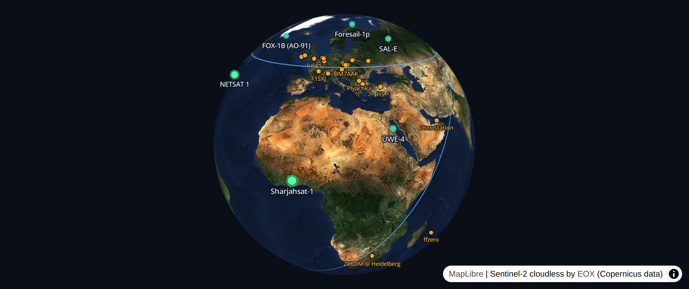

# Overwatch — a satellite control room from 100% open data

**Live**: https://overwatch.confinia.io · **API**: https://overwatch.confinia.io/api/v1 · **Write-up**: https://overwatch.confinia.io/article.html

A real-time control room for the ~23 cubesats currently broadcasting
decodable open telemetry: their positions on a MapLibre globe, their
batteries, temperatures and currents decoded **locally from their actual
radio frames**, and the network of volunteer ground stations that heard
them — self-hosted in Europe on one small server.



## How it works

```
CelesTrak ─┐                 ┌─ MapLibre globe (web) ──── reads cache only
SatNOGS  ──┤─►  ingest  ─►  db (Postgres)                  │
           (the ONLY thing        ├─ Grafana (embedded panels)
            touching upstream)    └─ api (public /api/v1)
```

- **One caching boundary.** Exactly one service (`ingest`) calls the
  upstream APIs: CelesTrak elements every 6 h, SGP4 propagation locally
  every 15 s, SatNOGS telemetry every 30 min with cursor pagination.
  Visitor traffic never touches the upstreams.
- **Local decoding.** SatNOGS serves raw hex frames; the ingest decodes
  them with the community's 161 [Kaitai Struct decoders](https://gitlab.com/librespacefoundation/satnogs/satnogs-decoders)
  and flattens every numeric field into Postgres — plus canonical
  `battery_v / battery_i / battery_pct` fields normalized across buses,
  so one dashboard works for the whole fleet.
- **Who-heard-whom.** Each decoded frame is linked to the receiving
  station (position decoded from its Maidenhead locator) and to the
  satellite's position at reception time — the orange lines on the globe,
  clickable for per-frame details.

## Run it yourself

```sh
cd orbit-poc
cp .env.example .env          # optional: add a free SatNOGS token
docker compose up --build     # or podman-compose
# open http://localhost:8081  (grafana: http://localhost:3001/grafana)
```

Works without any token (positions + orbits); a free
[SatNOGS DB](https://db.satnogs.org) API key lights up the telemetry.

## Public API

Free during development: `GET /api/v1/satellites`, `/api/v1/track/{norad}`,
`/api/v1/receptions/{norad}`, `/api/v1/telemetry/{norad}` — docs at
[`/api/v1/docs`](https://overwatch.confinia.io/api/v1/docs), self-serve
keys via `POST /api/v1/keys {"email"}`. Rate limits apply.

## Production notes

Deployed with rootless podman behind a layered caddy edge: two complete
blue/green compose stacks with zero-downtime promotes and instant
rollback (`deploy/slots.sh`), a staging slot for pre-promotion
validation, and OpenTelemetry → Prometheus → Grafana observability.

## Data sources & licenses

- Telemetry & receptions: © [SatNOGS DB](https://db.satnogs.org)
  contributors, [CC-BY-SA](https://creativecommons.org/licenses/by-sa/4.0/) ·
  decoders: [satnogs-decoders](https://gitlab.com/librespacefoundation/satnogs/satnogs-decoders) (LGPL)
- Orbital elements: [CelesTrak](https://celestrak.org) — respect their
  [rate guidance](https://celestrak.org/NORAD/documentation/gp-data-formats.php)
- Basemap: [Sentinel-2 cloudless by EOX](https://s2maps.eu) (Copernicus
  data; free for non-commercial use)
- Country lookup (API metrics): DB-IP Country Lite (CC-BY 4.0)

## License

[AGPL-3.0](LICENSE). The core is and stays open source; managed hosting,
SLAs and private sovereign tenants are how the project sustains itself.

Security reports: contact@confinia.io (please report privately first).
