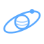
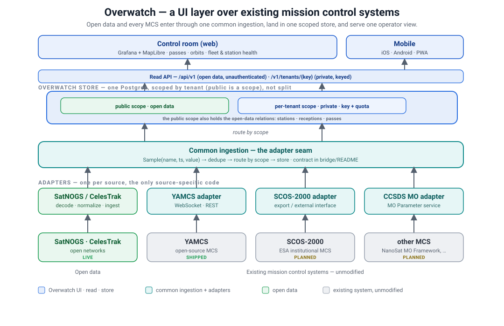

<p align="center"></p>

<h1 align="center">Overwatch</h1>

<p align="center"><b>A satellite control room. Open telemetry today, your own mission control system next.</b></p>

<p align="center">
<a href="https://overwatch.confinia.io">Live</a> ·
<a href="https://overwatch.confinia.io/api/v1/docs">API</a> ·
<a href="https://overwatch.confinia.io/article.html">Write-up</a>
</p>

Overwatch is one operator view — passes, orbits, fleet and station health, and
decoded telemetry — sitting on top of the data you already have. Today it runs
on 100% open data (the SatNOGS network and CelesTrak). The same view plugs into
an existing mission control system through a small adapter, without changing the
MCS. Self-hosted in Europe on one small server.



## What it answers, at a glance

- **Is my station okay?** Reception health for any ground station, scored against
  its own history, with a per-pass "was it me, or was it quiet?" breakdown.
- **Where is the fleet?** Live positions and pass predictions on a MapLibre
  globe, orbits propagated locally with SGP4.
- **What came down?** Battery, temperatures and currents decoded locally from the
  actual radio frames, one dashboard across the whole fleet.
- **Who heard whom?** Every frame linked to the receiving station and to the
  satellite's position at the moment of reception.

## Connect a mission control system

The tenant that holds open telemetry holds private telemetry too. A **bridge**
subscribes to an MCS and pushes its parameters into an isolated Overwatch tenant,
changing nothing on the MCS side:

- **YAMCS** — shipped: WebSocket subscription with REST polling fallback
  ([bridge](orbit-poc/bridge/yamcs)).
- **SCOS-2000, CCSDS MO (ESA NanoSat MO Framework), …** — the same seam takes
  each as a small adapter ([the contract](orbit-poc/bridge/README.md)).

One MCS-neutral core (`Sample(name, ts, value)` → dedupe → push) is shared; each
MCS is one thin adapter, and the MCS is never modified.

## Run it yourself

```sh
cd orbit-poc
cp .env.example .env          # optional: a free SatNOGS token lights up telemetry
docker compose up --build     # or podman-compose
# open http://localhost:8081
```

Works with no token (positions + orbits); a free [SatNOGS DB](https://db.satnogs.org)
key adds decoded telemetry.

## How the open-data side works

Exactly one service (`ingest`) talks to the upstreams — CelesTrak elements every
6 h, SGP4 propagation every 15 s, SatNOGS telemetry every 30 min — and everything
a visitor touches reads a local Postgres cache. Raw hex frames are decoded locally
with the community's 161 [Kaitai Struct decoders](https://gitlab.com/librespacefoundation/satnogs/satnogs-decoders)
and normalized (`battery_v / battery_i / battery_pct`) so one dashboard fits the
whole fleet.

## Production

Rootless podman behind a layered Caddy edge: two blue/green stacks with
zero-downtime promotes and instant rollback, a staging slot for pre-promotion
checks, and OpenTelemetry → Prometheus → Grafana observability.

## Public API

`GET /api/v1/satellites`, `/track/{norad}`, `/receptions/{norad}`,
`/telemetry/{norad}` — docs at [`/api/v1/docs`](https://overwatch.confinia.io/api/v1/docs),
self-serve keys via `POST /api/v1/keys {"email"}`. Rate limits apply.

## Data sources & licenses

- Telemetry & receptions: © [SatNOGS DB](https://db.satnogs.org) contributors,
  [CC-BY-SA](https://creativecommons.org/licenses/by-sa/4.0/) · decoders:
  [satnogs-decoders](https://gitlab.com/librespacefoundation/satnogs/satnogs-decoders) (LGPL)
- Orbital elements: [CelesTrak](https://celestrak.org) — respect their
  [rate guidance](https://celestrak.org/NORAD/documentation/gp-data-formats.php)
- Basemap: [Sentinel-2 cloudless by EOX](https://s2maps.eu) (Copernicus data;
  free for non-commercial use)
- Country lookup (API metrics): DB-IP Country Lite (CC-BY 4.0)

## License

[AGPL-3.0](LICENSE). The core is and stays open source; managed hosting, SLAs and
private sovereign tenants are how the project sustains itself.

Security reports: contact@confinia.io (please report privately first).
